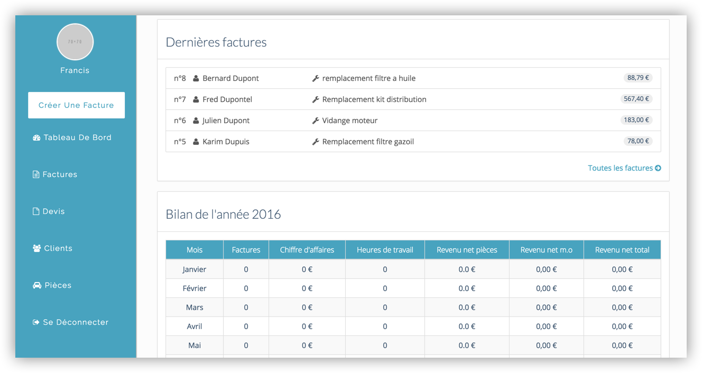

# Mechanic Invoice

## Presentation

Mechanic Invoice is a simple, free and easy-to-use web app for independent mechanics. It helps them handle their quotes, invoices and balance sheet.

## Configuration

The app configuration lies in `config/application.yml` and is **not**
versionned by git (for security reasons).

## Credits

The first commit of this app has been generated with [lewagon](https://github.com/lewagon/wagon_rails)'s rails best practices.

## Deploying

    $ bin/deploy
